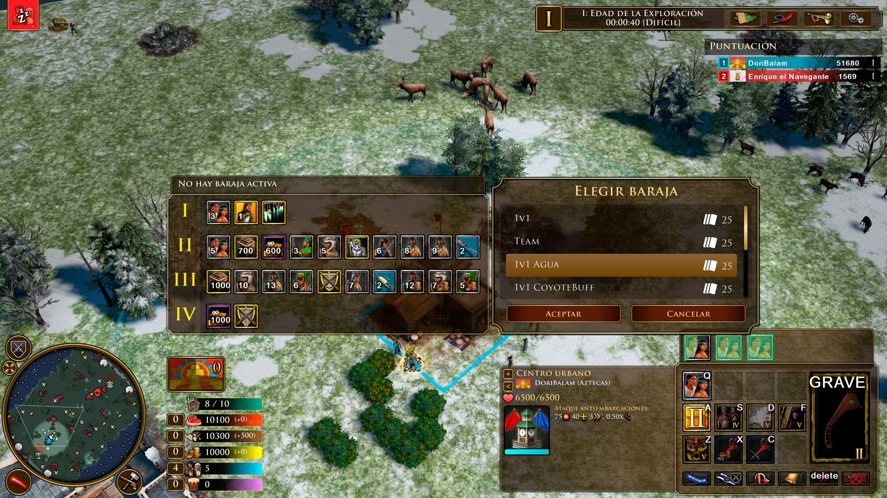
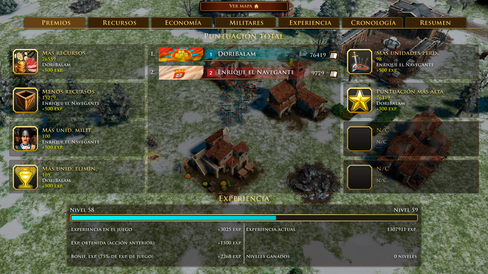

AOE III DE UI mod

https://www.ageofempires.com/mods/details/108407/

- Transparency to Commands Panel
- Transparency to Mini deck Panel
- Transparency to Bar Menu
- Transparency to Unit Info Panel
- Red idle villagers Button
- Resources Panel: Colors to improve the readability of each resource
- Transparency to Post Game Screen

